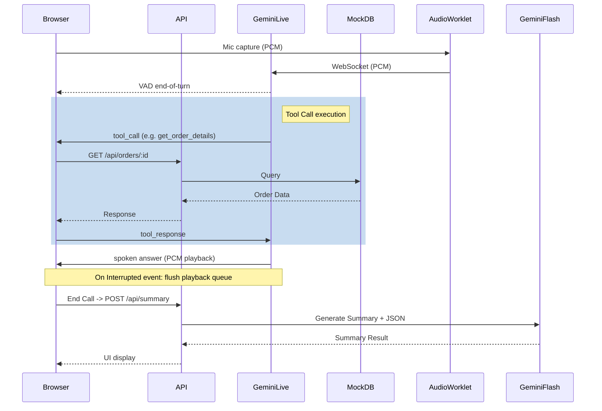

# Architecture

## Diagram

## Turn Flow
- VAD end-of-turn -> model decides tool -> toolCall -> API -> toolResponse -> spoken answer.
- On interrupted event: flush playback queue.

## Rationale
- Fewest network hops = lowest latency.
- Free tier hosting suitable.
- Secrets kept server-side.
- Deterministic business logic.

## Non-Functional Requirements (NFRs)
- First audio < 1.5s.
- Tool round trip < 300ms.
- Reconnect handling.
- Ephemeral tokens with short TTL.
- 5-min session cap.
- Per-turn latency logging.
- Chrome/Edge first.
- Safari AudioContext resume on click.

## Scale Notes (1,000 calls/day)
- Auth + rate limits.
- Cost caps.
- Telephony via SIP/Twilio.
- Postgres transcripts.
- Real order APIs.
- Automated eval suite.
- Human handoff.
- Monitoring.
- Provider failover.

## Hosting
- Hosted on Vercel.
